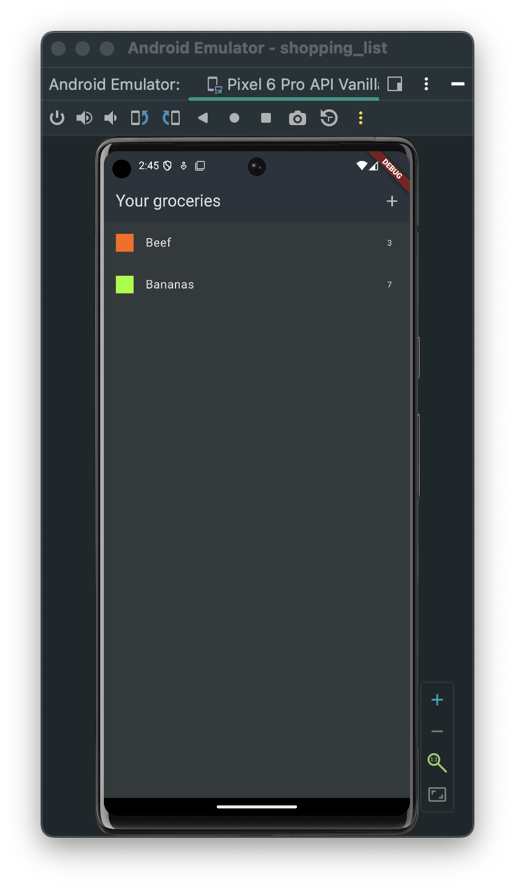
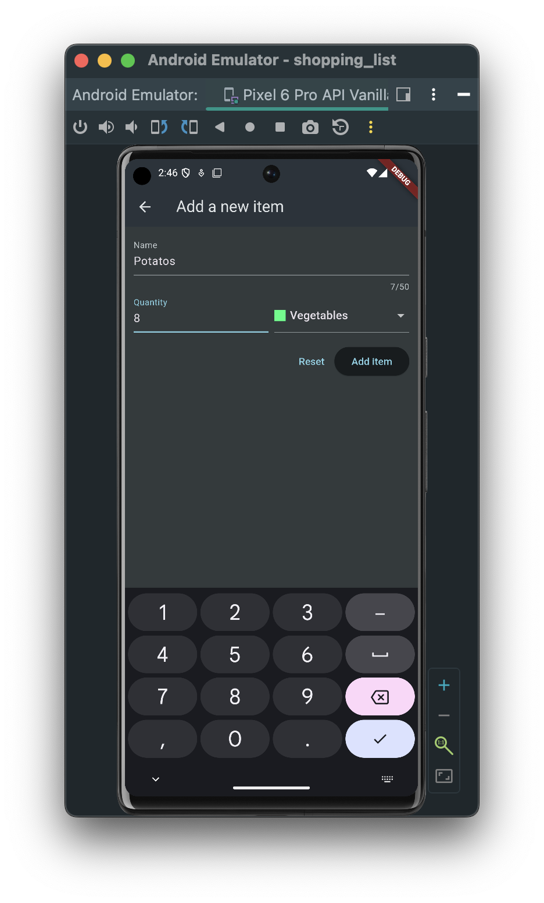
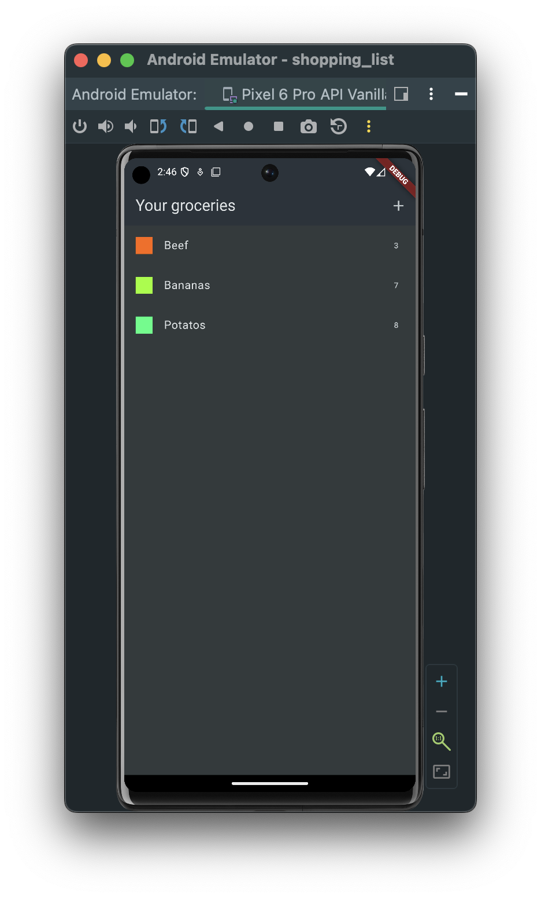
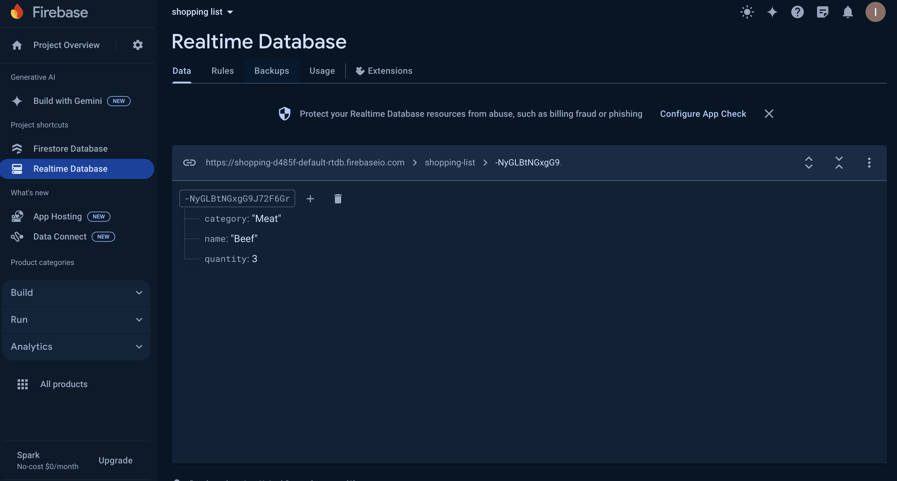

# Shopping list
The application was developed on a course https://www.udemy.com/course/learn-flutter-dart-to-build-ios-android-apps/

This app is designed to create a handy grocery list.

 

The application uses a simple backend service based on Firebase.

